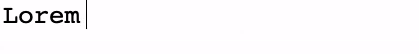

# How to implement typewriting effect

_B Vinoth Raj_  
_Jan 21, 2022_  
  
There can be numerous ways one may achieve the typewriting effect. Here are two options.   

**Option 1: Quick and Easy way**  
This option is as easy as adding a class to the element containing the text. There is no Javascript.  
  
  
  
We will use CSS animation to achieve the typewriting effect.  
Here is the class that defines the effect: 
```
.typewriting {
   overflow: hidden;
   white-space: nowrap;
   font-family: monospace;
   font-size: 1.6rem;
   animation: typewriter 2s steps(15) infinite;
   border-right: 1px solid black;
}

@keyframes typewriter {
  from {
    width: 0%;
  }
  to {
    width: 100%;
  }

```
Let us understand how the typing effect is achieved:
```
animation: typewriter 2s steps(15) infinite;
```
The *@keyframes* rule specifies the animation code.  
We use an animation rule called "typewriter".  
The animation is created by gradually changing from one set of CSS styles to another using the "from" and "to".  
The *animation duration* is of 2s.  
*steps(15)* is the *animation-timing-function* that specifies the number of intervals in the function which is 15.  
The *animation-iteration-count* is *infinite*. So, if you want to iterate specific times you can specify an integer.  

[Try in CodePen](https://codepen.io/bvinraj/pen/GRMbQdg){:target="\_blank"}. 

**Option 2: Using custom property**  
This option requires use of Javascript to set the text to custom property.  
Using CSS function **var** and custom property "--characters" we can create the same effect.
  
We get a more realistic effect here as the *animation-timing-function* has the number of intervals set with the character length of the string.  
  
    
  


```
.typewriter-effect {
  display: flex;
  justify-content: center;
  font-family: monospace;
}

.typewriter-effect > .text {
  max-width: 0;
  animation: typing 3s steps(var(--characters)) infinite;
  white-space: nowrap;
  overflow: hidden;
}

.typewriter-effect:after {
  content: " |";
  animation: blink 1s infinite;
  animation-timing-function: step-end;
}

@keyframes typing {
  75%,
  100% {
    max-width: calc(var(--characters) * 1ch);
  }
}

@keyframes blink {
  0%,
  75%,
  100% {
    opacity: 1;
  }
  25% {
    opacity: 0;
  }
}
```
And the Javascript code is this:
```
const typeWriter = document.getElementById('typewriter-text');
const text = 'Lorem ipsum dolor sit amet.';

typeWriter.innerHTML = text;
typeWriter.style.setProperty('--characters', text.length);
```
[Try in CodePen](https://codepen.io/bvinraj/pen/vYeqepq){:target="\_blank"}  

[back](../)
