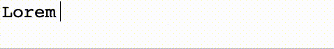

# How to implement typewriting effect

_B Vinoth Raj_  
_Jan 21, 2022_  
  
There can be numerous ways one may achieve the typewriting effect. Here are two options.   

**Option 1: Quick and Easy way**  
This option is as easy as adding a class to the element containing the text. There is no Javascript.  

We will use CSS animation to achieve the typewriting effect.  
Here is the class that defines its effect: 
```
.typewriting {
   overflow: hidden;
   white-space: nowrap;
   font-family: monospace;
   font-size: 1.6rem;
   animation: typewriter 2s steps(15) infinite;
   border-right: 1px solid black;
}

Let us understand how the typing effect is achieved:
```
animation: typewriter 2s steps(15) infinite;
```
We use an animation rule called "typewriter".  
The animation is created by gradually changing from one set of CSS styles to another using the "from" and "to".
The animation duration is of 2s. 
steps(15) is the animation-timing-function that specifies the number of intervals in the function which is 15.
The animation-iteration-count is infinite. So, if you want to iterate specific times you can specify an integer.

```
The @keyframes rule specifies the animation code.
```
@keyframes typewriter {
  from {
    width: 0%;
  }
  to {
    width: 100%;
  }
```

[Try in CodePen](https://codepen.io/bvinraj/pen/GRMbQdg)


[back](../)
