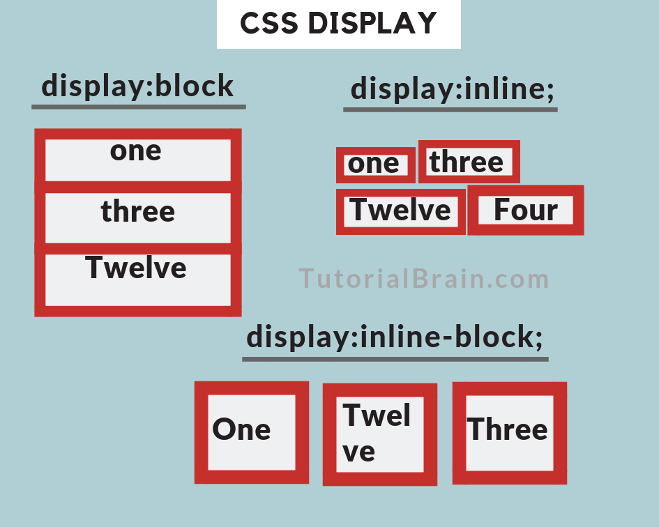

# Difference between box model elements i.e Block elements, Inline elements and Inline-Block elements

_Gyanswarup Mohanty_  
_Feb 02, 2022_  

Block Elements
1- Elements visualise as blocks.

2- Consumes the 100% parent's width.

3- Comes vertically one after another.

4- Box model applies as shown.

5- Example:- div, p, header etc.

Inline Elements
1- Elements occupies only the content's space.

2- Comes one after another means there is no line break between elements.

3- Box model is different as height and width do not apply.

4- Padding and margins are only applied horizontally i.e only left and right.

5- Example:- a, img, input etc.

Inline-Block Elements
1- Looks like inline from outside but behaves like block from inside.

2- Elements occupies only the content's space.

3- Comes one after another means there is no line break between elements.

4- Box model applies as shown.

[Try in CodePen](https://codepen.io/Gyani007/pen/eYeZogZ){:target="\_blank"}

[back](../)
