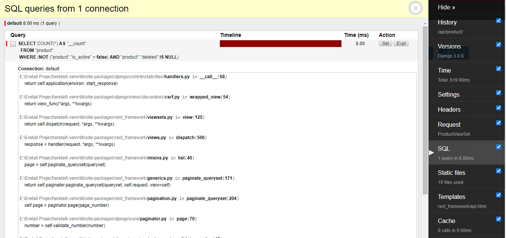

# How to debug your django application using django-debug-toolbar

_Pardeep_
_Jan 20, 2022_

The Django Debug Toolbar allows you to view all SQL queries performed while rendering view and you can also view stacktrace for any of them.

## 6 Steps needs to be configured for the Debug Toolbar to be fully functional.

### 1. Install the package

```
$ python -m pip install django-debug-toolbar
```

### 2. Check for Prerequisites

First, ensure that `django.contrib.staticfiles` is in your `INSTALLED_APPS` setting, and configured properly:

```


INSTALLED_APPS = [
    # ...
    "django.contrib.staticfiles",
    # ...
]

STATIC_URL = "static/"
```

Second, ensure that your `TEMPLATES` setting contains a `DjangoTemplates` backend whose `APP_DIRS` options is set to `True`:

```
TEMPLATES = [
    {
        "BACKEND": "django.template.backends.django.DjangoTemplates",
        "APP_DIRS": True,
        # ...
    }
]
```

### 3. Install the App

Add `debug_toolbar` to your `INSTALLED_APPS` setting:

```
INSTALLED_APPS = [
    # ...
    "debug_toolbar",
    # ...
]
```

### 4. Add the URLs

Add django-debug-toolbar’s URLs to your project’s URLconf:

```
from django.urls import include, path

urlpatterns = [
    # ...
    path('__debug__/', include('debug_toolbar.urls')),
]
```

### 5. Add the Middleware

The Debug Toolbar is mostly implemented in a middleware. Add it to your `MIDDLEWARE` setting:

```
MIDDLEWARE = [
    # ...
    "debug_toolbar.middleware.DebugToolbarMiddleware",
    # ...
]
```

### 6. Configure Internal IPs

The Debug Toolbar is shown only if your IP address is listed in Django’s `INTERNAL_IPS`setting.

```
INTERNAL_IPS = [
    # ...
    "127.0.0.1",
    # ...
]
```

---

After performing all these steps, you will be able to see a debug toolbar in your django application when it is running.

##### Sample application with debug toolbar implemented



Github link - [https://github.com/robhudson/django-debug-toolbar/](https://github.com/robhudson/django-debug-toolbar/)

Official docs - [https://django-debug-toolbar.readthedocs.io/en/latest/](https://django-debug-toolbar.readthedocs.io/en/latest/)

[back](../)
