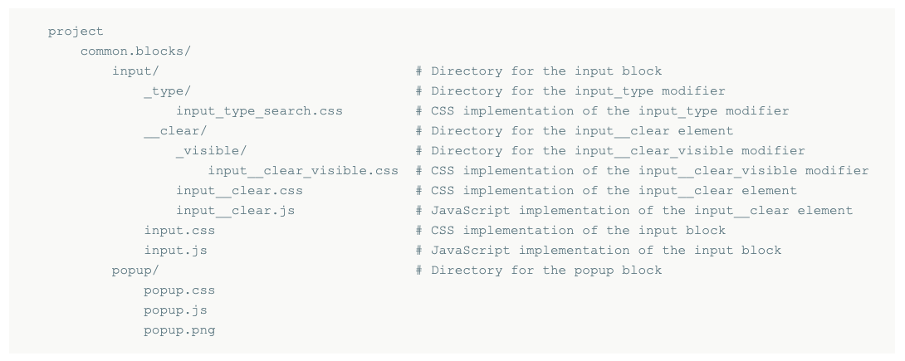

# What is BEM?

_B Vinoth Raj_  
_Jan 25, 2022_  

BEM (Block, Element, Modifier) is a **methodology for frontend web development**.   
The idea behind it is to **divide the user interface into independent blocks**.  
Its goal is to help developers better understand the relationship between the HTML and CSS in a given project.  
  
BEM methodology allows you to:  
- Create the architecture/structure for your project.
- Develop web applications based on independent blocks.

## Who created it?
BEM was developed by Yandex.  
Yandex is a Russian company. It is the largest technology company in Russia. Its search engine is second largest in Russia.

## Key Concepts: Blocks, Elements, and Modifiers

Blocks, elements, and modifiers are all called BEM entities.

**Block**: A functionally independent page component that can be reused.  
**Element**: An element is always part of a block, and you shouldn't use it separately from the block.  
**Modifier**: An entity that defines the appearance, state, or behavior of a block or element.  

Here is an example of a website.  
In this picture *Header*, *Main Layout* and *Footer* are blocks. The *Header* in turn consists of more blocks: *Logo*, *Search*, *Auth Block* and *Menu*.

Following figure shows different blocks in the *Header* block of the website.

Here is an illustration of block and its elements:

## BEM Project Structure
All BEM projects follow a similar structure in their file structure.   
The component approach adopted in the BEM methodology also applies to projects in the file structure. The implementations of blocks, elements, and modifiers are divided into independent technology files.

- A single block corresponds to a single directory.
- The block and the directory have the same name. For example, the header block is in the header/ directory
- A block's implementation is divided into separate technology files. For example, header.css (for style) and header.js (for behavior).

Here is an example of project file structure that contains two blocks: input and popup.

## References
[https://en.bem.info/methodology/](https://en.bem.info/methodology/)  
[https://www.smashingmagazine.com/2012/04/a-new-front-end-methodology-bem/](https://www.smashingmagazine.com/2012/04/a-new-front-end-methodology-bem/)  
[https://css-tricks.com/bem-101/](https://css-tricks.com/bem-101/)  
  
[back](../)
