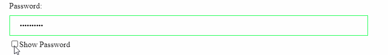

# How to toggle between password visibility 

_Pardeep_ <br />
_Jan 23, 2022_ <br />

We use password fields in many signup/login forms in our applications. By default text in the password field is masked so we can't see the actual text we have written. <br />

Sometimes we need to check what actually we have entered as password. <br />



We can easily handle this functionality using very simple JS logic. <br />

Follow the two steps below: <br />

* Add HTML

<div id="container">
  <!-- Password field -->
  Password: <input type="password" value="Toggle@123" id="password">

<!-- An element to toggle between password visibility -->
  <div>
    <input type="checkbox" onclick="togglePassword()">Show Password
  </div>
</div>

* Add JS

```
function togglePassword() {
  var x = document.getElementById("password");
  if (x.type === "password") {
    x.type = "text";
  } else {
    x.type = "password";
  }
}
```
Let's understand the logic above. <br />

If current input type is password we will change it to input type text and if input type is text, we will change it to input type password. <br />

[Try in CodePen](https://codepen.io/pardeep-thakur/pen/wvrVLQq){:target="\_blank"}

[back](../)
